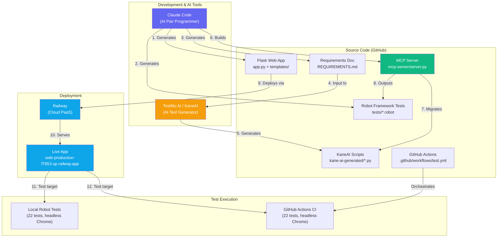
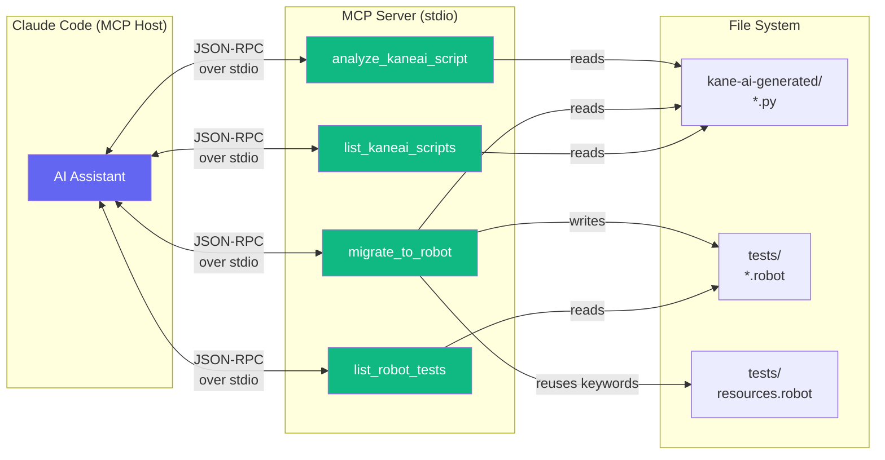

# End-to-End Workflow Summary

## Exercise Overview

This exercise demonstrates a complete AI-assisted test automation pipeline — from building a web application, to generating and migrating test scripts using multiple AI tools, to deploying with CI/CD. The workflow integrates **Claude Code**, **TestMu AI's KaneAI**, **Robot Framework**, **Railway**, and **GitHub Actions** into a cohesive development and testing lifecycle.

---

## Architecture Diagram

## Flow Diagram

```mermaid
flowchart LR
    A["1 Build Flask App<br/>(Claude Code)"] --> B["2 Write Robot Tests<br/>(Claude Code)"]
    B --> C["3 Deploy to Railway"]
    C --> D["4 Write Requirements Doc<br/>(Claude Code)"]
    D --> E["5 Generate Tests<br/>(KaneAI)"]
    E --> F["6 Build MCP Server<br/>(Claude Code)"]
    F --> G["7 Migrate KaneAI → Robot"]
    G --> H["8 Run All Tests<br/>(22/22 Pass)"]
    H --> I["9 Push & CI/CD<br/>(GitHub Actions)"]

    style A fill:#6366f1,color:#fff
    style B fill:#6366f1,color:#fff
    style C fill:#0ea5e9,color:#fff
    style D fill:#6366f1,color:#fff
    style E fill:#f59e0b,color:#fff
    style F fill:#10b981,color:#fff
    style G fill:#10b981,color:#fff
    style H fill:#22c55e,color:#fff
    style I fill:#8b5cf6,color:#fff
```

## MCP Server Architecture

## Test Migration Pipeline

---

## What Was Built

| Component | Files | Purpose |
|-----------|-------|---------|
| **Flask Web App** | `app.py`, `templates/index.html`, `static/style.css` | Single-page app with 16 interactive UI sections (login, counter, tabs, modal, drag-and-drop, etc.) and 3 API endpoints |
| **Robot Framework Tests** | `tests/web_tests.robot`, `tests/resources.robot` | 20 browser automation tests using SeleniumLibrary with shared keywords |
| **Requirements Doc** | `REQUIREMENTS.md` | 16 features, 50+ acceptance criteria — input for KaneAI test generation |
| **KaneAI Scripts** | `kane-ai-generated/*.py` | 2 Selenium/Python test scripts generated by TestMu AI's KaneAI |
| **MCP Server** | `mcp-server/server.py`, `.mcp.json` | 4-tool MCP server that analyzes and migrates KaneAI scripts to Robot Framework |
| **Migrated Tests** | `tests/kaneai_login_test_positive.robot`, `tests/kaneai_login_test_negative.robot` | 2 Robot Framework tests converted from KaneAI output |
| **Deployment** | `Procfile`, `railway.json` | Railway PaaS deployment config |
| **CI/CD** | `.github/workflows/test.yml` | GitHub Actions running all 22 tests against deployed app |

## Key Metrics

| Metric | Value |
|--------|-------|
| Total test cases | 22 (20 original + 2 migrated) |
| Test pass rate | 100% |
| UI components tested | 16 sections |
| API endpoints | 3 (`/api/login`, `/api/greet`, `/api/search`) |
| MCP tools created | 4 |
| CI pipeline | GitHub Actions → Railway |
| Deployment | Railway (public URL) |

## Tools & Technologies Used

| Category | Tool | Role |
|----------|------|------|
| AI Code Generation | **Claude Code** | Built the entire app, tests, MCP server, and deployment config |
| AI Test Generation | **TestMu AI / KaneAI** | Generated Selenium/Python test scripts from requirements |
| Test Framework | **Robot Framework** + SeleniumLibrary | Browser automation and test execution |
| Web Framework | **Flask** (Python) | Served the test target web application |
| Cloud Deployment | **Railway** | Hosted the app publicly |
| CI/CD | **GitHub Actions** | Automated test execution on every push |
| Protocol | **MCP (Model Context Protocol)** | Connected Claude Code to custom migration tooling |
| Browser Automation | **Selenium** + Chrome/ChromeDriver | Drove headless browser for tests |
| Version Control | **Git** + GitHub | Source code management |
